# Práctica 2 – Creación API REST
### Objetivo:

Esta práctica trata de aprender a diseñar e implementar una API REST sencilla utilizando Spring Boot. 
Para ello se ha desarrollado un servicio que permite gestionar un recurso Carrito mediante operaciones CRUD (crear, leer, actualizar y borrar), siguiendo el modelo request/response sobre HTTP. 
La API se ha implementado sin persistencia en base de datos, gestionando los datos en memoria, y se ha probado su funcionamiento utilizando Postman, verificando tanto casos correctos como algunos escenarios de error.
El sistema modela un caso simplificado de e-commerce, en el que cada carrito contiene un único producto gestionado en memoria.

## 1. Descripción de endpoints 

La API expone endpoints para gestionar el recurso Carrito mediante las operaciones CRUD. Las peticiones POST y PUT reciben un cuerpo en formato JSON y están sujetas a validación. En caso de error, la API responde con códigos HTTP estándar (400, 404, 409) según corresponda.

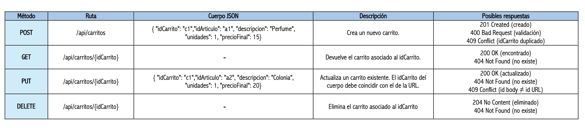

## 2. Ejecución en Postman

Para verificar el correcto funcionamiento de la API REST desarrollada, se han realizado distintas pruebas utilizando la herramienta Postman.
En esta sección se muestran capturas de las peticiones realizadas a cada uno de los endpoints, comprobando tanto los casos correctos como las posibles situaciones de error.

### POST
Crear un recurso carrito

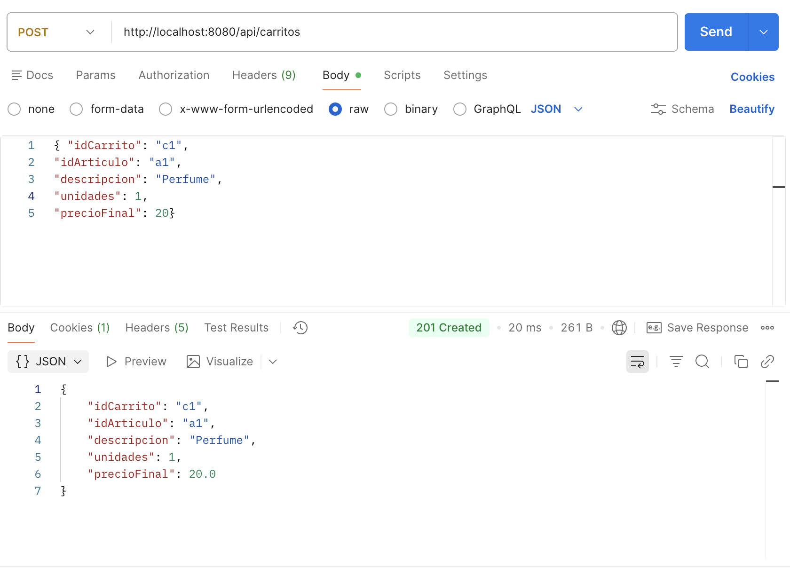

Crear un recurso carrito con campos incorrectos

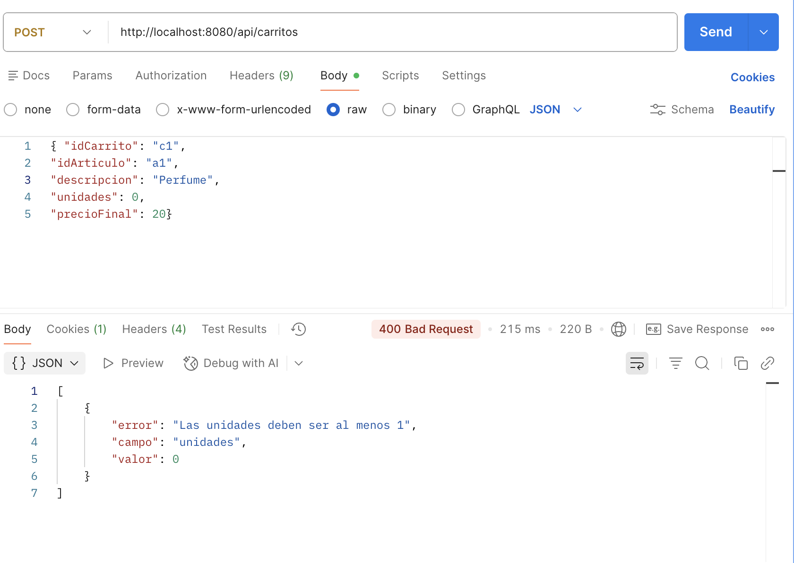

Crear un recurso carrito duplicado

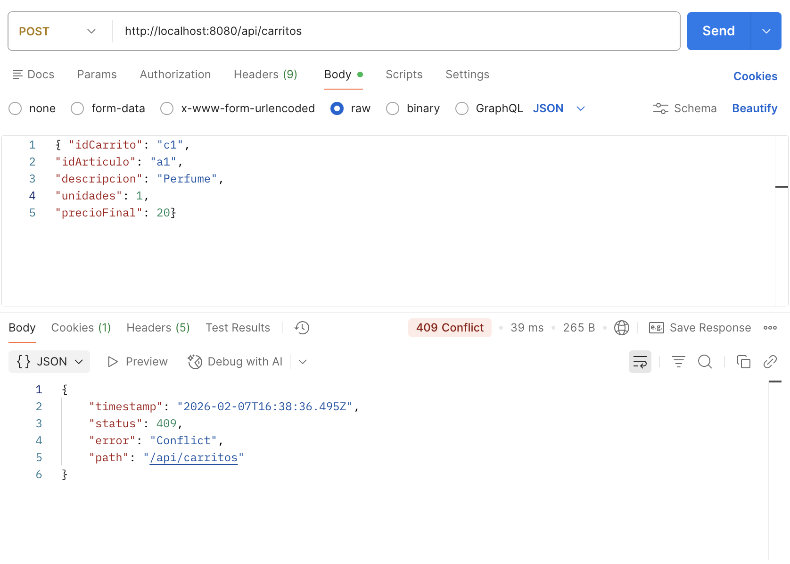

### GET
Leer carrito existente

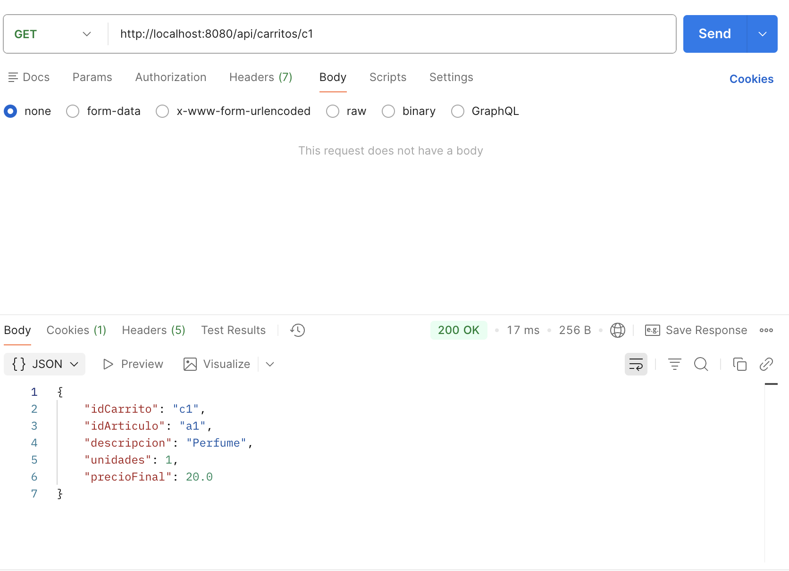

Leer carrito inexistente 

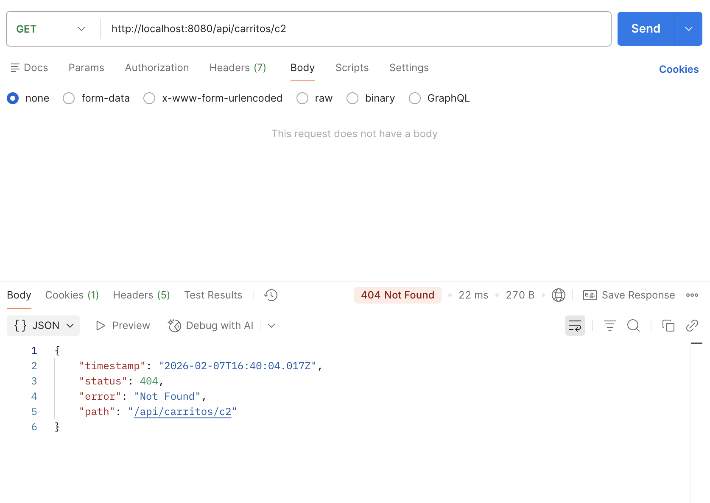

### PUT 
Actualizar carrito existente

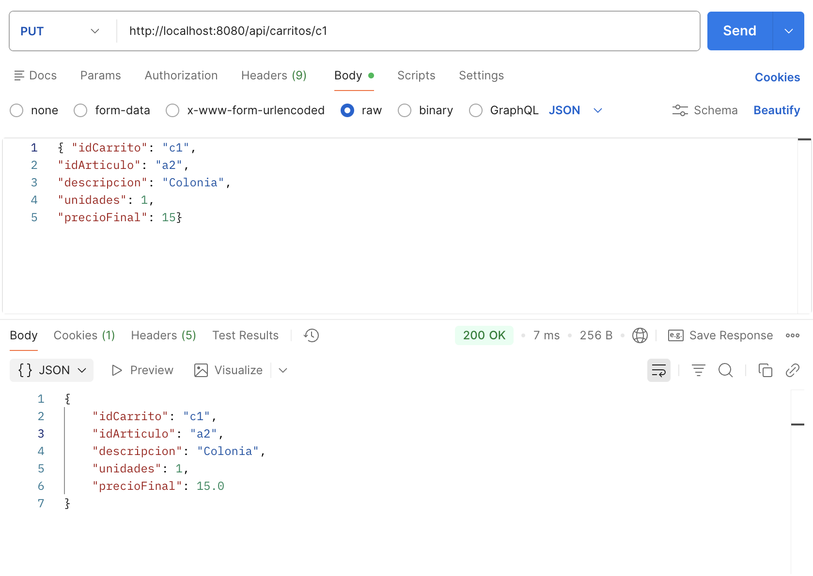

Actualizar carrito inexistente 

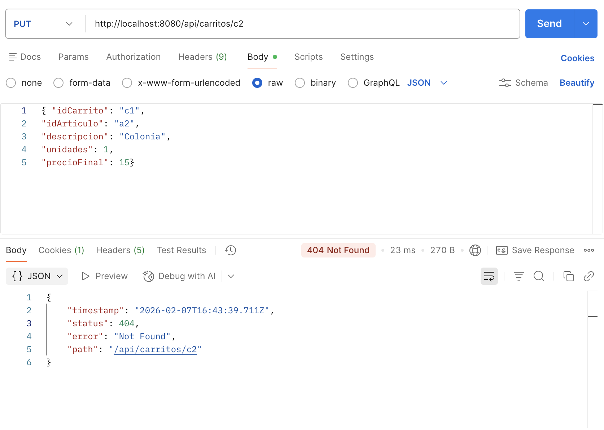

Actualizar carrito cuyo id no coincide con la url

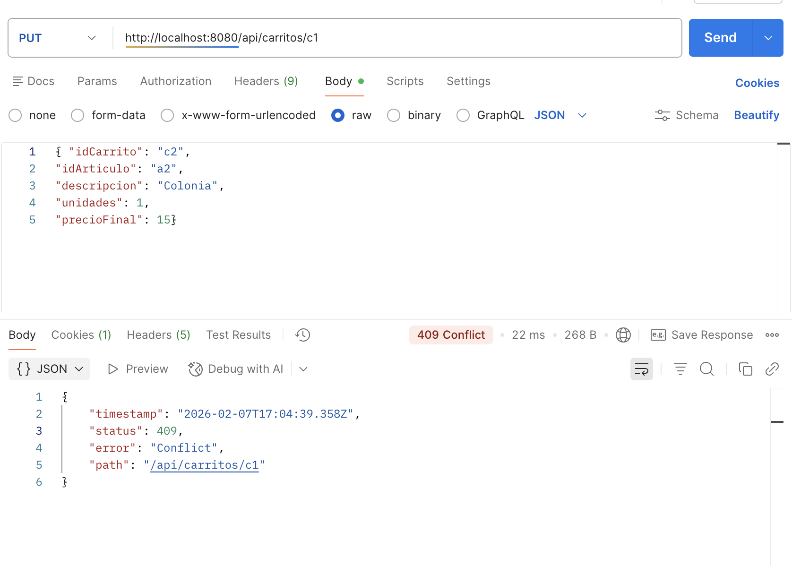

### DELETE 
Borrar carrito existente 

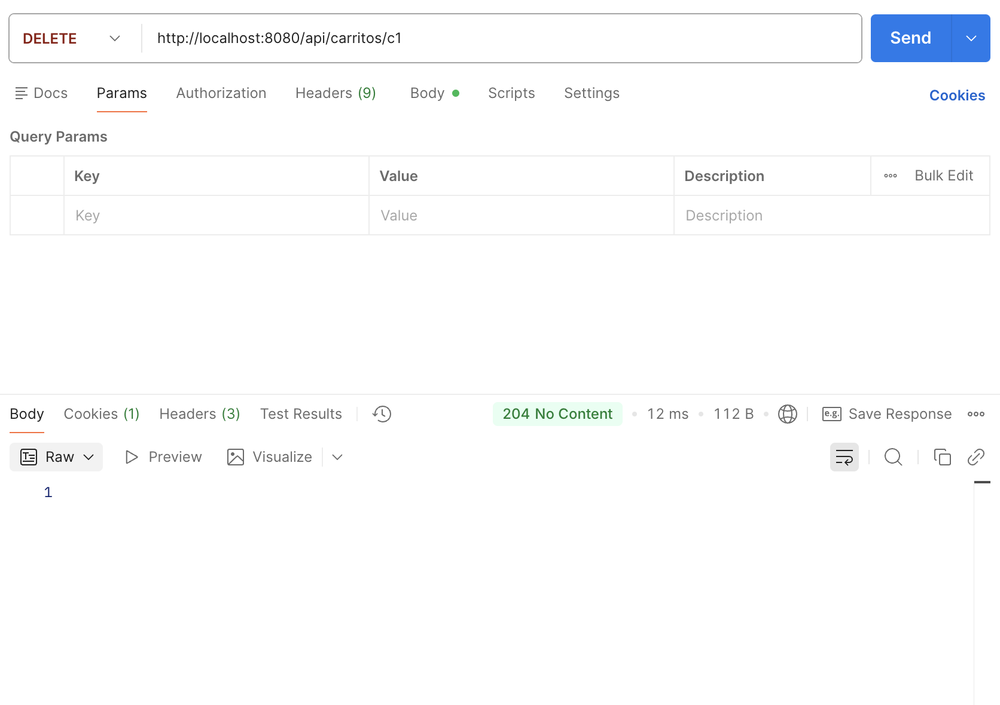

Borrar carrito inexistente 

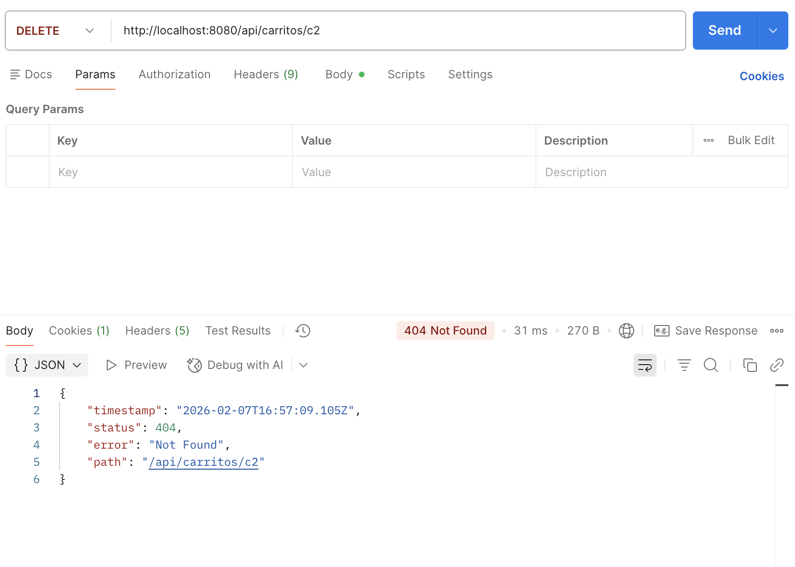

## 3. Estructura del Repositorio
El repositorio contiene los siguientes elementos principales:

- [imagenes/](./imagenes) – Carpeta que contiene las capturas de las pruebas realizadas con Postman.
- [src/main/java/edu/comillas/icai/gitt/pat/spring/p2/](./src/main/java/edu/comillas/icai/gitt/pat/spring/p2) – Código fuente de la aplicación Spring Boot.
    - ControladorRest –> Controlador REST que define los endpoints del recurso Carrito.
    - ModeloCarrito –> Modelo que representa el recurso Carrito.
    - ModeloCampoIncorrecto –> Modelo utilizado para devolver errores de validación.
    - ExcepcionCarritoIncorrecto –> Excepción personalizada para el manejo de errores de validación.
    - P2Application –> Clase principal que arranca la aplicación Spring Boot.
- [src/main/resources/](./src/main/resources) – Recursos de la aplicación.
- [src/test/](./src/test) – Estructura destinada a pruebas (no utilizada en esta práctica).
- [pom.xml](./pom.xml) – Archivo de configuración Maven con las dependencias del proyecto.
- [README.md](./README.md) – Documento descriptivo de la práctica.

## 4. Conclusión

Con la realización de esta práctica se ha podido consolidar el uso de Spring Boot para la creación de servicios REST sencillos. A lo largo del desarrollo se han aplicado conceptos como la validación de datos, el manejo de errores mediante códigos HTTP y la organización básica de un proyecto Spring.
El resultado es una API clara y funcional que cumple con los requisitos planteados y permite comprender mejor el flujo  de trabajo en el desarrollo de un servicio REST.

